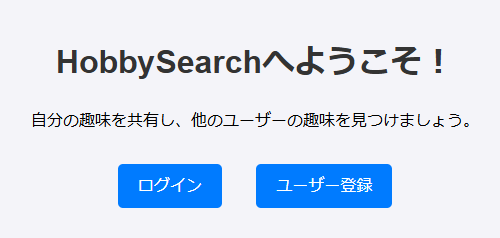
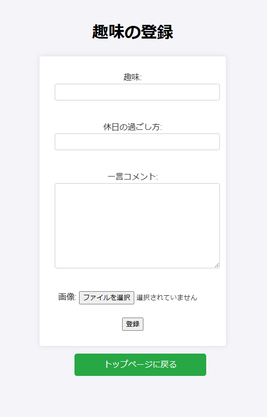
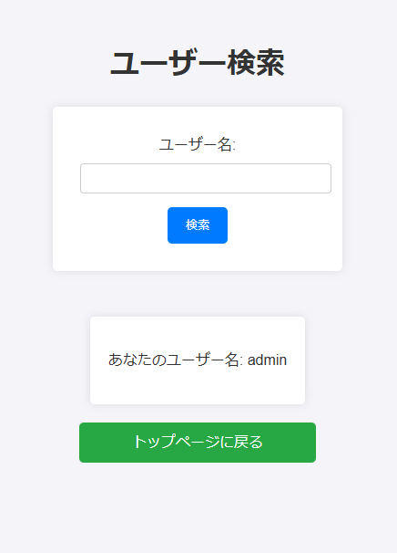
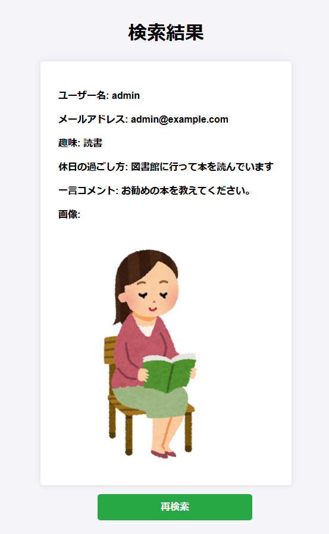

# hobbySearch

## INDEX

1. [プロジェクトについて](#プロジェクトについて)
2. [動作環境](#環境)
3. [デモ画面](#デモ画面)
4. [実行準備](#実行準備)

## プロジェクトについて
SBキャリアカレッジ梅田校「Python/Javaプログラマー養成科」の授業の一環としてWebアプリケーションを作成しました。 
・ターゲットユーザー 
  会社の従業員 
・目的 
　従業員同士のコミュニケーションを円滑にする 
・所感 
　初めて一人で作ったアプリケーションだったので何をするにもchatgptに「この〇〇.jspに〇〇のような機能を付けるにはどうすれば良いか」
　うまく動作しなかった時はエラーコードを丸々copy＆pasteで貼り付け「何が原因か」などを質問に質問を重ね完成しました。

(<a href="#top">トップへ</a>)

## 環境
- バックエンド
    - java (version 22.0.2)
    - H2 Database (version 2.3.232)
    - Apache Tomcat (Tomcat10_Java21)
- フロントエンド
    - HTML
    - CSS

(<a href="#top">トップへ</a>)

## デモ画面
【トップ画面】スタート画面です。 
 

【登録画面】趣味の登録画面です。 
 

【検索画面】ユーザーの検索画面です。 
 

【結果画面】検索の結果画面です。  
 

(<a href="#top">トップへ</a>)

## 実行準備
1.Githubのリポジトリからzipファイルをダウンロード 
2.Eclipseに「hobby」をインポート 
3.H2 Databaseで「hobby.mv.db」を読み込み 
4.Tomcat10_Java21で「index.jsp」を実行 

(<a href="#top">トップへ</a>)

